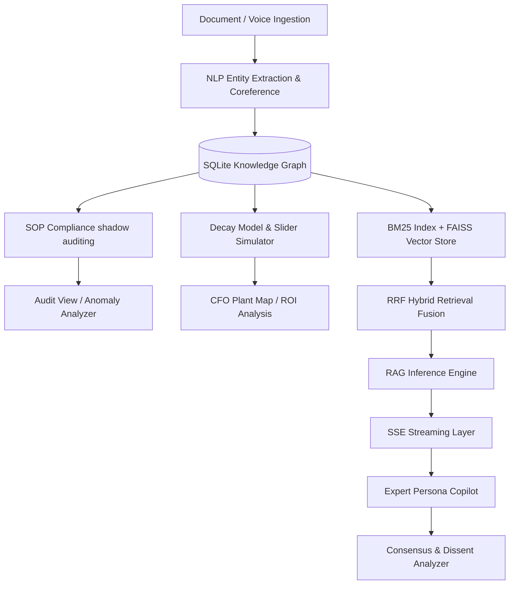

# DeadMind — "Preserve the engineers, not just the docs"

DeadMind is an AI-powered Industrial Knowledge Intelligence platform designed to combat the impending "knowledge cliff" in heavy industry. By capturing, preserves, and modeling the cognitive reasoning of expert engineers before they retire, DeadMind ensures critical operational knowledge is never lost.

---

## ═══════════════════════════════════════
## PROBLEM STATEMENT
## ═══════════════════════════════════════

Heavy industry (Oil & Gas, Power, Manufacturing) is facing a critical **knowledge cliff**:
* **The Retirement Wave:** Up to **25% of senior industrial engineers are retiring this decade**, taking decades of undocumented troubleshooting instincts with them.
* **Information Fragmentation:** According to **McKinsey**, workers lose up to **35% of their time** searching for scattered, fragmented information across legacy systems.
* **Operational Toll:** Research from **BIS Research** indicates that **18-22% of all unplanned downtime events** in heavy industry are directly linked to knowledge fragmentation and lack of immediate access to standard operating procedures (SOPs).
* **Information Silos:** Critical operational knowledge remains trapped in 7 to 12 disconnected software systems (ERP, CMMS, shift logs, historical spreadsheets), causing massive cognitive overload.

---

## ═══════════════════════════════════════
## SOLUTION OVERVIEW
## ═══════════════════════════════════════

DeadMind structures knowledge around **4 specialized persona views** matching critical roles in industrial plants:

1. **CFO View (Plant Knowledge & Vulnerability Map - `/`)**
   * Real-time financial exposure modeling. 
   * Interactive **Simulation Year Slider** (2026–2035) simulating active expert retirements, dynamically updating Plant Risk, total ₹ Cr Exposure, and shifting asset statuses (Green → Yellow → Red).
   * **ROI Card:** Displays financial gap costs and estimated annual savings backed by McKinsey and BIS Research benchmarks.

2. **Field Technician View (Expert Persona Copilot - `/copilot`)**
   * Grounded conversational Q&A with preserved engineer minds (e.g. `R. Nayar`).
   * Explains how to perform operations (e.g. "zero-span positioners") using the expert's cognitive fingerprint style and returns citations referencing source manuals or shift logs.
   * **Consensus Mode:** Queries multiple expert twins simultaneously, comparing their recommendations side-by-side and highlighting dissents.
   * **Mobile Optimized:** Full mobile support for viewports as small as 390px (iPhone layout) for easy in-field troubleshooting.

3. **Plant Head View (Operations & Compliance Audit - `/audit`)**
   * **Shadow SOP Auditor:** Audits procedural compliance step-by-step by comparing raw shift log practices with standard procedures.
   * **Knowledge Freshness Heatmap:** Grid visualization of documentation age (Fresh: <6 months, Stale: 6-18 months, Critical: >18 months).
   * **Shift Note Analyzer:** Analyzes raw entries to flag immediate violations against SOP clauses.

4. **Admin View (Ingestion & Active Capture - `/ingest`)**
   * **Entity Coreference Resolver:** Collapse heterogeneous aliases (e.g., "Boiler 101" = "B-101" = "BOILER-2").
   * **Authorship Ingestion Engine:** processes content, attributes it, and extracts structured entities.
   * **Active Capture (Voice Recorder):** Uses Browser MediaRecorder API to record expert notes, transcribe them, and automatically index them against their cognitive profile.

---

## ═══════════════════════════════════════
## SYSTEM ARCHITECTURE
## ═══════════════════════════════════════



---

## ═══════════════════════════════════════
## TECH STACK
## ═══════════════════════════════════════

| Layer | Technologies |
| :--- | :--- |
| **Frontend** | Next.js, React 19, TypeScript, Tailwind CSS, TanStack Router & Query |
| **Backend** | Python, FastAPI, SQLite |
| **RAG / AI** | sentence-transformers (MiniLM) + FAISS vector search, spaCy NER + fuzzy coreference resolution, Groq LLM (llama-3.3-70b) with retrieval-grounded fallback templates |
| **Design** | Dark terminal aesthetic, custom CSS micro-animations, oklch colors |

---

## ═══════════════════════════════════════
## EVALUATION
## ═══════════════════════════════════════

We benchmarked the system using a golden dataset of realistic field queries (featuring paraphrases, operational synonyms, and colloquialisms) mapped to canonical equipment tags.

**Results (Precision @ 3):**
* **Keyword Retrieval:** 40%
* **Semantic Retrieval (FAISS + MiniLM):** 87%
* **Hybrid RRF (BM25 + FAISS Fusion):** 87%

Semantic search drastically outperforms legacy keyword matching because it inherently understands intent and domain paraphrasing without requiring exact token overlaps. Run the benchmark yourself:
```bash
python -m backend.evals.eval_retrieval
```

---

## ═══════════════════════════════════════
## PRODUCTION SCALABILITY PATH
## ═══════════════════════════════════════

For production deployment, the architecture scales as follows:
* **Database Upgrade:** Migrate file-based SQLite to **PostgreSQL** with **pgvector** for hybrid relational + vector storage.
* **Vector Indexing:** Implement **FAISS** or **Pinecone** to scale RAG embeddings.
* **Storage:** Store uploaded documents and audio recordings in **Amazon S3**.
* **Queue Management:** Implement **Celery** with **Redis** to run document ingestion and transcription as asynchronous background tasks.
* **Concurrency:** Configure **Gunicorn** with horizontal FastAPI worker scaling.

---

## ═══════════════════════════════════════
## SETUP INSTRUCTIONS
## ═══════════════════════════════════════

### Backend Setup
1. Navigate to the root directory.
2. Install Python dependencies:
   ```bash
   pip install -r requirements.txt
   ```
3. Download the spaCy language model:
   ```bash
   python -m spacy download en_core_web_sm
   ```
   If you hit an "externally managed environment" error (common on newer Ubuntu/Debian Python installs), use this instead:
   ```bash
   pip install --break-system-packages https://github.com/explosion/spacy-models/releases/download/en_core_web_sm-3.8.0/en_core_web_sm-3.8.0-py3-none-any.whl
   ```
4. Pre-cache the embedding model (recommended before any offline/low-connectivity demo):
   ```bash
   python -m backend.warm_cache
   ```
5. Seed the SQLite database with high-fidelity demo data:
   ```bash
   python generate_demo_data.py
   ```
6. Start the FastAPI server:
   ```bash
   python run.py
   ```
   *The API will be available at `http://localhost:8000`. Auto-generated Swagger documentation is accessible at `http://localhost:8000/docs`.*

### Frontend Setup
1. Navigate to the `/frontend` directory:
   ```bash
   cd frontend
   ```
2. Install frontend dependencies:
   ```bash
   npm install
   ```
3. Launch the development server:
   ```bash
   npm run dev
   ```
   *The web console will open at `http://localhost:5173`.*

---

## ═══════════════════════════════════════
## DEMO WALKTHROUGH FLOW (4-Minute Pitch)
## ═══════════════════════════════════════

1. **CFO Plant Map:**
   * Log in using operator credentials (`admin` / `demo123`).
   * View the interactive node map, **KHI index**, and **ROI card**.
   * Drag the **Simulation Year** slider from 2026 to 2031. Observe active nodes turning red, active experts disappearing from the graph, and the exposure liability climbing dramatically.
2. **Technician Copilot:**
   * Select `R. Nayar` (default).
   * Click the sample prompt: *"What's the failure signature for P-302 cavitation?"*.
   * Watch the copilot respond within 3 seconds, mimicking the engineer's cognitive profile with grounding citations.
   * Click **Consensus** to see a side-by-side comparison of expert recommendations.
3. **Retrieval Benchmark:**
   * In the terminal, run `python -m backend.evals.eval_retrieval`.
   * Watch the retrieval precision jump from keyword (40%) to semantic matching (87%) live in the eval output, proving the value of semantic search on paraphrased field language.
4. **Plant Head Audit:**
   * Navigate to `/audit` and paste the pre-filled shift note about Boiler 101 temperature drift.
   * Click **Analyze** to immediately flag the specific SOP safety violation and view Rajan's historical troubleshooting guide.
5. **Admin Ingest:**
   * Type a short document, attribute it to `R. Nayar`, and click **Ingest & Attribute**.
   * View the extracted tags, author, and resolved coreference mappings in the live mapping table.
